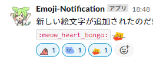

# Emoji-Notification-SlackBot

Notify specific channels that an emoji has been added



## requirements
- golang
- (ngrok)
- terraform
- aws

### `.env`

| ENV | Description |
| -------- | -------- |
| SLACK_BOT_TOKEN |  Bot User OAuth Access Token<br />String beginning with `xoxb-` |
| CHANNEL_ID | For sending notifications |
| aws_profile | Example: "default" |
| aws_region | Example: "ap-northeast-1" |
| resource_prefix | Example: "Emoji-Notification-SlackBot" |

## Deploy
```
terraform apply -var-file .env
```

### Register API_ENDPOINT with the slack API.

1. Copy the output api_endpoint.
1. Access [Slack API](https://api.slack.com)
1. Create your app
1. Turn on Enable Events in "Event Subscriptions" and register API_ENDPOINT in the Request URL.


